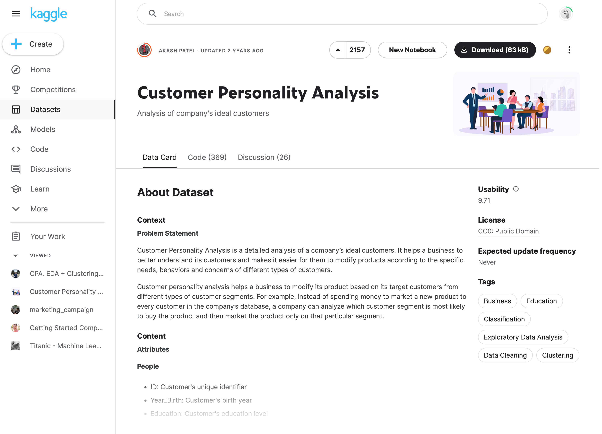

# 프로그래머스 Monthly Project #1

&nbsp;
## 데이터셋
Kaggle - [Customer Personality Analysis](https://www.kaggle.com/datasets/imakash3011/customer-personality-analysis)  


&nbsp;
## 환경 설정
프로젝트 GitHub Repository 다운로드(또는 클론)
```shell
git clone https://github.com/hunnxx/Programmers_Monthly_Project_1_a2.git
```
가상환경 생성
```shell
python -m venv <virtual_env_name>
```
가상환경 실행
```shell
# if linux or mac
source <virtual_env_name>/bin/activate
# if window
./<virtual_env_name>/Scripts/activate
```
Python 라이브러리 설치
```shell
pip install requirements.txt
```
Python 라이브러리 설치 확인
```shell
pip freeze
```

&nbsp;
## 프로젝트 실행
서버 실행 `in /Programmers_Monthly_Project_1_a2/monthly_proj_1`
```shell
cd monthly_proj_1
python manage.py runserver
```
[프로젝트 결과물 확인](http://127.0.0.1:8000)
